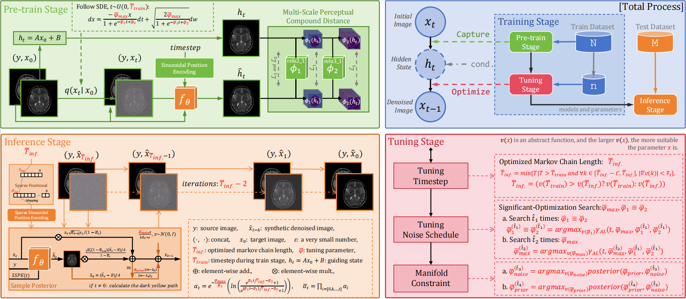

<hr>
<h1 align="center">
  UMT-EDDM <br>
  <sub>UMT-EDDM: Using Known Optimal to Derive Unknown Optimal</sub>
</h1>
<div align="center">
  <a href="https://github.com/" target="_blank">***</a><sup>1,2</sup> &ensp; <b>&middot;</b> &ensp;
  <a href="https://github.com/" target="_blank">***</a><sup>1,2</sup> &ensp; <b>&middot;</b> &ensp;
  <a href="https://github.com/" target="_blank">***</a><sup>1,2</sup> &ensp; <b>&middot;</b> &ensp;
  <a href="https://github.com/" target="_blank">***</a><sup>1,2</sup> &ensp; <b>&middot;</b> &ensp;
  <a href="https://github.com/" target="_blank">***</a><sup>1,2</sup> &ensp; <b>&middot;</b> &ensp;
  <a href="https://github.com/" target="_blank">***</a><sup>1,2</sup> &ensp; <b>&middot;</b> &ensp;

<span></span>
  <span></span>
  
  <sup>1</sup>111 &emsp; <sup>2</sup>222 &emsp; <sup>3</sup>333 &emsp; <sup>4</sup>444 <br>
</div>
<hr>

<hr>
<h3 align="center">[<a href="https://arxiv.org/">arXiv</a>]</h3>

Official PyTorch implementation of **UMT-EDDM**. Experiments demonstrate that our method performs effectively across three medical datasets and one thermal infrared visible light facial dataset.

<p align="center">
  
</p>

## 🐹 Installation

This repository has been developed and tested with `CUDA 11.7` and `Python 3.8`. Below commands create a conda environment with required packages. Make sure conda is installed.

```
conda env create --file requirements.yaml
conda activate eddm
```

## 🐼 Prepare dataset
The default data set class GetDataset requires a specific folder structure for organizing the data set.
Modalities (such as `T1, T2, etc.`) should be stored in separate folders, while splits `(train, test, and optionally val)` should be arranged as subfolders containing `2D` images named `slice_0.png or .npy, slice_1.png or .npy`, and so on.
To utilize your custom data set class, implement your version in `dataset.py` by inheriting from the `EDDMDataset` class.

```
<datasets>/
├── <modality_a>/
│   ├── train/
│   │   ├── slice_0.png or .npy
│   │   ├── slice_1.png or .npy
│   │   └── ...
│   ├── test/
│   │   ├── slice_0.png or .npy
│   │   └── ...
│   └── val/ (The file does not exist by default)
│       ├── slice_0.png or .npy
│       └── ...
├── <modality_b>/
│   ├── train/
│   ├── test/
│   └── val/ (The file does not exist by default)
├── ...
  
```

## 🙉 Pre-Training

Execute the following command to start or resume training.
Model checkpoints are stored in the `/checkpoints/$LOG` directory.
The script supports both `single-GPU` and `multi-GPU` training, with `single-GPU` mode being the default setting.

The example training code is as follows: 
```
python train_EDDM.py \
  --input_channels 1 \
  --source T1 \
  --target T2 \
  --batch_size 2 \
  --max_epoch 120 \
  --lr 1.5e-4 \
  --input_path ./datasets/BrainTs20 \
  --checkpoint_path ./checkpoints/brats_1to2_EDDM_logs
```

### Argument descriptions

| Argument                  | Description                                                                                           |
|---------------------------|-------------------------------------------------------------------------------------------------------|
| `--input_channels`        | Dimension of images.                                                                                  |
| `--source` and `--target` | Source Modality and Target Modality, e.g. 'T1', 'T2'. Should match the folder name for that modality. |
| `--batch_size`            | Train set batch size.                                                                                 |
| `--lr`                    | Learning rate.                                                                                        |
| `--max_epoch`             | Number of training epochs (default: 120).                                                             |
| `--input_path`            | Data set directory.                                                                                   |
| `--checkpoint_path`       | Model checkpoint path to resume training.                                                             |
| `--lambda_l1`             | [Optional] Composite ratio of loss items.                                                             |
| `--lambda_l2`             | [Optional] Composite ratio of loss items.                                                             |
| `--lambda_perceptual`     | [Optional] Composite ratio of loss items.                                                             |
| `--vp_t`                  | [Optional] Maximum training time step.                                                                |
| `--val`                   | [Optional] Use the validation phase during the training process.                                      |
| `--MO`                    | [Optional] Hidden state multiplication operator.                                                      |
| `--AO`                    | [Optional] Hidden state addition operator.                                                            |

## 🐧 Tuning

Run the following command to start tuning.
The predicted images are saved under `/checkpoints/$LOG/generated_samples` directory.
By default, the script runs on a `single GPU`. 

```
python tuning_EDDM.py \
  --input_channels 1 \
  --source T1 \
  --target T2 \
  --batch_size 2 \
  --tuning_dataset_num 200 \
  --which_epoch 120 \
  --gpu_chose 0 \
  --input_path ./datasets/BrainTs20 \
  --checkpoint_path ./checkpoints/brats_1to2_EDDM_logs
```

## 🐣 Testing

Run the following command to start testing.
The predicted images are saved under `/checkpoints/$LOG/generated_samples` directory.
By default, the script runs on a `single GPU`. 

```
python test_EDDM.py \
        --input_channels 1 \
        --source T1 \
        --target T2 \
        --batch_size 2 \
        --which_epoch 120 \
        --gpu_chose 0 \
        --input_path ./datasets/BrainTs20 \
        --checkpoint_path ./checkpoints/brats_1to2_EDDM_logs \
        --vp_t 9 \
        --vp_k 7 \
        --vp_max 22.5 \
        --vp_sparse 2 \
        --vp_noise 100.0 \
        --vp_prior 0.05
```

### Argument descriptions

Some arguments are common to both training and testing and are not listed here. For details on those arguments, please refer to the training section.

| Argument        | Description                                                           |
|-----------------|-----------------------------------------------------------------------|
| `--batch_size`  | Test set batch size.                                                  |
| `--which_epoch` | Model checkpoint path.                                                |
| `--vp_t`        | [Optional] Maximum time step in the inference phase.                  |
| `--vp_max`      | [Optional] Maximum intensity of noise schedule in inference stage.    |
| `--vp_k`        | [Optional] Inference stage noise schedule with added noise curvature. |
| `--vp_sparse`   | [Optional] Sparse coefficient of time step.                           |
| `--vp_noise`    | [Optional] Noise prior mixing ratio.                                  |
| `--vp_prior`    | [Optional] Noise prior mixing ratio.                                  |

## 🐸 Checkpoint

Refer to the testing section above to perform inference with the checkpoints. PSNR (dB), SSIM (%) and MAE are listed as mean ± std across the test set.

The paper is currently undergoing blind review. If you need weight open source or code open source, please contact us `elephantoh@qq.com`.

| Dataset | Task      | PSNR         | SSIM         | MAE           | Checkpoint                   |
|---------|-----------|--------------|--------------|---------------|------------------------------|
| BRATS   | T1→T2     | 25.53 ± 2.08 | 91.92 ± 1.73 | 0.0275 ± 4.68 | [Link](https://github.com/)  |
| BRATS   | T2→T1     | 24.52 ± 1.82 | 92.38 ± 1.16 | 0.0313 ± 4.09 | [Link](https://github.com/)  |
| OASIS3  | T1→T2     | 23.05 ± 6.49 | 80.52 ± 5.84 | 0.0298 ± 9.82 | -                            |
| OASIS3  | T2→T1     | 23.59 ± 6.12 | 82.10 ± 4.63 | 0.0310 ± 1.01 | -                            |
| IXI     | T1→T2     | 27.85 ± 3.17 | 91.30 ± 0.85 | 0.0170 ± 1.12 | -                            |
| IXI     | T2→T1     | 27.90 ± 4.97 | 93.60 ± 0.88 | 0.0187 ± 3.72 | -                            |
| TFW     | VIS.→THE. | 21.08 ± 3.73 | 77.86 ± 2.63 | 0.0515 ± 1.80 | [Link](https://github.com/)  |

## 🐮 Tuning RESULT

This result is obtained by using the open source weights mentioned above and running the `tuning_EDDM.py` code file.

| Dataset | Task      | vp_t | vp_max | vp_k | vp_sparse | vp_noise | vp_prior |
|---------|-----------|------|--------|------|-----------|----------|----------|
| BRATS   | T1→T2     | 9    | 22.5   | 5.00 | 2         | 100.00   | 0.05     |
| BRATS   | T2→T1     | 4    | 17.5   | 3.00 | 1         | 50.00    | 0.00     |
| OASIS3  | T1→T2     | 8    | 17.5   | 4.00 | 2         | 50.00    | 0.05     |
| OASIS3  | T2→T1     | 4    | 17.5   | 6.00 | 2         | 50.00    | 0.00     |
| IXI     | T1→T2     | 4    | 27.5   | 4.00 | 2         | 50.00    | 0.10     |
| IXI     | T2→T1     | 4    | 22.5   | 6.00 | 1         | 0.00     | 0.05     |
| TFW     | VIS.→THE. | 4    | 20.    | 6.00 | 1         | 0.00     | 0.00     |


## 🦊 Code

The code for the `test` is open, and the code for the `pre-train` and `tuning` will be made public shortly.

## 🐭 Citation

You are encouraged to modify/distribute this code. However, please acknowledge this code and cite the paper appropriately.
```

```

<hr>
